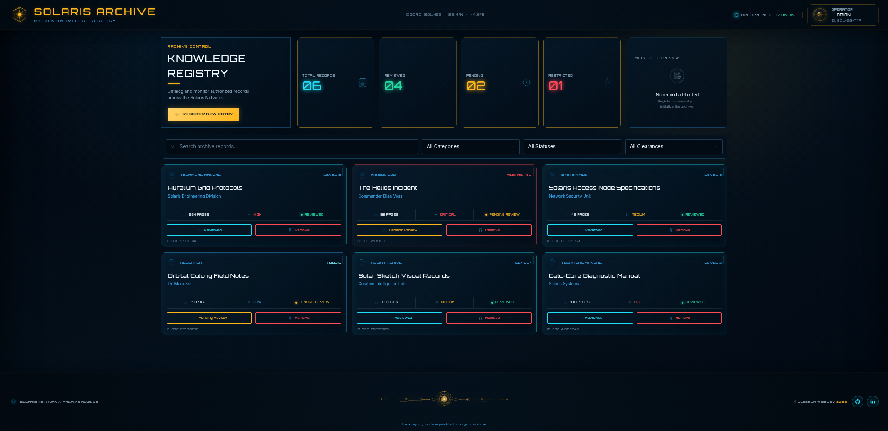

<div align="center">


# Project Library

# Solaris Archive

### Mission Knowledge Registry

A responsive cyber-solar library application for registering, classifying, reviewing, searching, and managing knowledge records through a polished mission-control interface.

[](./index.html)
[](./styles.css)
[](./script.js)
[](./LICENSE)
[](https://www.theodinproject.com/)

[Repository](https://github.com/progritit/Library)

</div>

---



## Overview

**Solaris Archive** reimagines a conventional book-tracking application as a secure knowledge registry within the Solaris Network universe. Books become archive records containing operational metadata such as category, priority, classification level, page count, and review status.

The project was created for **The Odin Project — Library** assignment and focuses on object construction, prototype methods, array management, DOM rendering, form handling, and the separation of application data from its visual representation.

> **Note:** The registry operates entirely in memory. Records added or removed during a session are reset when the page is reloaded, as persistent storage is intentionally outside the project requirements.

## Key Features

- Register new archive entries through an accessible native `<dialog>` form.
- Create consistent record objects with a JavaScript `Book` constructor.
- Generate stable record identifiers with `crypto.randomUUID()`.
- Render the interface dynamically from the `myLibrary` array.
- Toggle records between **Reviewed** and **Pending Review** through a shared prototype method.
- Remove individual records without relying on their array position.
- Search across titles, authors, categories, priorities, and classifications.
- Filter records by category, review status, and clearance level.
- Update total, reviewed, pending, and restricted statistics automatically.
- Display contextual empty states for an empty library or filters with no matches.
- Adapt the dashboard across desktop, tablet, and mobile layouts.
- Provide keyboard focus states, ARIA labels, semantic markup, and reduced-motion support.
- Display an automatically updating copyright year.
- Link to the developer's GitHub and LinkedIn profiles through animated footer controls.

## Tech Stack

| Area | Technology |
| --- | --- |
| Structure | Semantic HTML5 |
| Styling | CSS3, CSS Grid, Flexbox, custom properties, media queries |
| Application logic | Vanilla JavaScript (ES6+) |
| Data model | Constructor functions, prototypes, arrays, UUIDs |
| Browser APIs | DOM API, `FormData`, native `<dialog>`, `crypto.randomUUID()` |
| Typography | Self-hosted Orbitron and Inter web fonts |
| Version control | Git and GitHub |
| Deployment target | GitHub Pages |

No framework, package manager, build tool, backend, or external JavaScript dependency is required.

## Getting Started

### Prerequisites

You only need:

- a modern browser with support for the native `<dialog>` element and `crypto.randomUUID()`;
- Git, to clone the repository;
- optionally, Python 3 or the VS Code Live Server extension to run a local development server.

### Installation

Clone the repository and enter the project directory:

```bash
git clone https://github.com/progritit/Library.git
cd Library
```

### Run locally

#### Option 1: Python development server

```bash
python3 -m http.server 5500
```

On Windows, the equivalent command may be:

```bash
py -m http.server 5500
```

Then open:

```text
http://localhost:5500
```

#### Option 2: VS Code Live Server

```bash
code .
```

Open `index.html`, then select **Open with Live Server**.

#### Option 3: Direct browser access

Because the project has no build process, you may also open `index.html` directly. A local server is still recommended because it more closely matches deployment behavior.

### Environment Variables

This project does not require environment variables, API keys, or secret configuration.

## Usage

### Register an entry

1. Select **Register New Entry**.
2. Provide the record title, author or source, category, page count, priority, and classification.
3. Optionally mark the record as already reviewed.
4. Select **Add to Archive**.

The form submission is intercepted with `event.preventDefault()`. JavaScript creates a new `Book`, adds it to `myLibrary`, closes the dialog, and renders the updated registry.

### Manage records

- Select **Reviewed** or **Pending Review** on a card to toggle its status.
- Select **Remove** to delete the corresponding object from the array.
- Use the search field for free-text matching.
- Combine category, status, and clearance filters to narrow the visible records.

### Session behavior

The application deliberately does not use `localStorage` or a database. Reloading the page restores the initial demonstration records.

## Architecture

The application follows a simple data-driven rendering model:

```text
User action
    ↓
Update myLibrary or one Book object
    ↓
Run renderLibrary()
    ↓
Clear the existing record grid
    ↓
Generate DOM cards from the current data
    ↓
Update dashboard statistics
```

### Separation of responsibilities

| Responsibility | Main implementation |
| --- | --- |
| Create a record | `Book()` constructor |
| Toggle review status | `Book.prototype.toggleRead()` |
| Store a record | `addBookToLibrary()` |
| Remove a record | `removeBookFromLibrary()` |
| Select visible records | `getVisibleBooks()` |
| Build one card | `createBookCard()` |
| Rebuild the interface | `renderLibrary()` |
| Update telemetry | `updateStatistics()` |

The `myLibrary` array is the application's **single source of truth**. The DOM does not independently own record data; it mirrors the current state of the array.

### Project structure

```text
Library/
├── assets/
│   ├── branding/
│   │   ├── favicon.png
│   │   ├── operator-orion-badge.png
│   │   └── solaris-archive-emblem.png
│   ├── fonts/
│   │   ├── inter-400.woff2
│   │   ├── inter-500.woff2
│   │   ├── inter-600.woff2
│   │   ├── orbitron-500.woff2
│   │   ├── orbitron-600.woff2
│   │   └── orbitron-700.woff2
│   ├── icons/
│   ├── illustrations/
│   └── screenshots/
│       └── library-preview.png
├── index.html
├── styles.css
├── script.js
├── LICENSE
└── README.md
```

## Running Tests

No automated test suite is currently configured. The project can be validated with the following manual smoke test:

1. Load the page and confirm that all initial records render.
2. Add a record and verify that the card and statistics update.
3. Toggle the new record's review status.
4. Search for the record by title and author.
5. Test each filter independently and in combination.
6. Remove records and verify that the correct cards disappear.
7. Remove every record and confirm that the empty state appears.
8. Resize the browser to verify desktop, tablet, and mobile layouts.
9. Navigate controls using only the keyboard.
10. Reload the page and confirm that the initial in-memory data is restored.

Optional static validation tools:

- [W3C HTML Validator](https://validator.w3.org/)
- [W3C CSS Validator](https://jigsaw.w3.org/css-validator/)
- Browser developer tools and accessibility audits

## Deployment

The project is a static site and can be deployed directly with GitHub Pages.

1. Push the repository to GitHub.
2. Open **Settings → Pages**.
3. Under **Build and deployment**, choose **Deploy from a branch**.
4. Select the `main` branch and the `/ (root)` directory.
5. Save the configuration.

Once enabled, the expected project URL is:

```text
https://progritit.github.io/Library/
```

No production build command is required.

## Accessibility

The interface includes:

- semantic landmarks and headings;
- descriptive labels for form controls;
- keyboard-visible focus states;
- an accessible native modal dialog;
- `aria-label` text for icon-only or ambiguous controls;
- `aria-pressed` on review-status toggles;
- an `aria-live` record region for dynamic updates;
- decorative images with empty alternative text;
- a reduced-motion media query.

## Credits and Attributions

### Curriculum

- Project specification inspired by **[The Odin Project — Library](https://www.theodinproject.com/)**.

### Fonts

- **[Orbitron](https://fonts.google.com/specimen/Orbitron)** — designed by Matt McInerney and maintained by The League of Moveable Type / the Orbitron Project. Distributed under the **SIL Open Font License 1.1**.
- **[Inter](https://rsms.me/inter/)** — designed by Rasmus Andersson and maintained by the Inter Project. Distributed under the **SIL Open Font License 1.1**.

The font files are self-hosted within the project for consistent rendering and performance.

### Visual assets

- Solaris Archive branding, operator badge, interface icons, orbital ornament, empty-state illustration, and related visual assets were created specifically for this project through an AI-assisted design workflow and prepared for implementation by **Clebson Web Dev**.
- The interface preview screenshot was captured from the completed project and is stored at `assets/screenshots/library-preview.png`.
- GitHub and LinkedIn marks are used only to identify and link to their respective services. Their names and logos remain trademarks of their respective owners.

## Contributing

Contributions, bug reports, and improvement suggestions are welcome.

1. Fork the repository.
2. Create a focused branch:

   ```bash
   git checkout -b feature/your-feature-name
   ```

3. Make and test your changes.
4. Commit with a descriptive message:

   ```bash
   git commit -m "Add descriptive change summary"
   ```

5. Push the branch:

   ```bash
   git push origin feature/your-feature-name
   ```

6. Open a pull request explaining the purpose and impact of the change.

Please keep pull requests focused, preserve accessibility, and avoid adding dependencies unless they provide a clear benefit.

## License

This project is licensed under the **MIT License**. See [`LICENSE`](./LICENSE) for the complete terms.

## Author

**Clebson Web Dev**

- [GitHub](https://github.com/progritit)
- [LinkedIn](https://www.linkedin.com/in/clebsoncosta)

---

<div align="center">

Built as part of a structured full-stack web-development learning journey.

</div>
